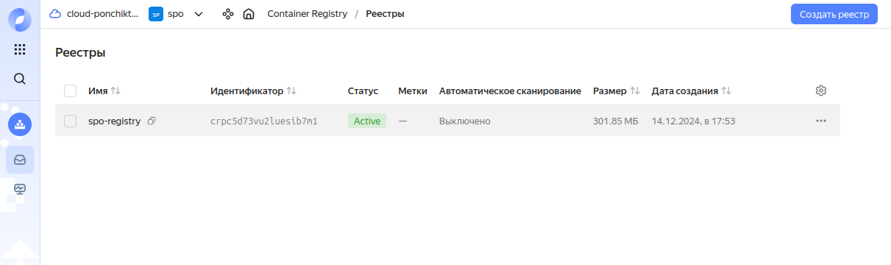
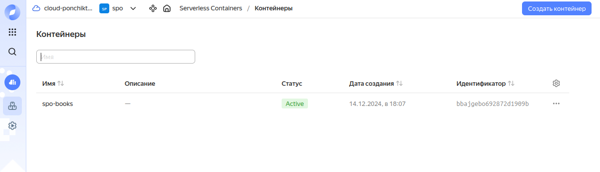
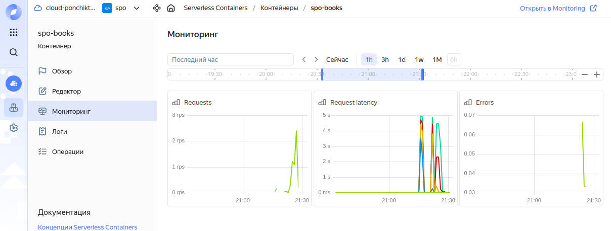
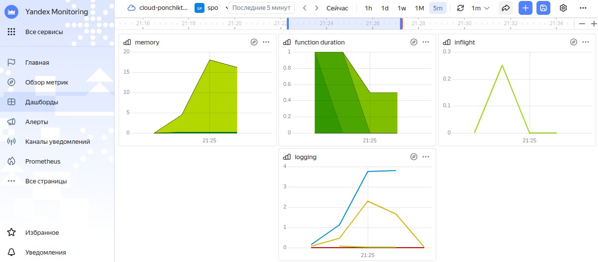
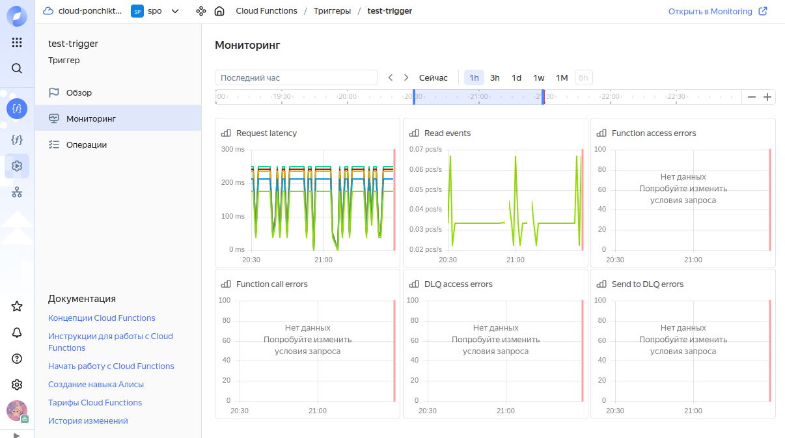
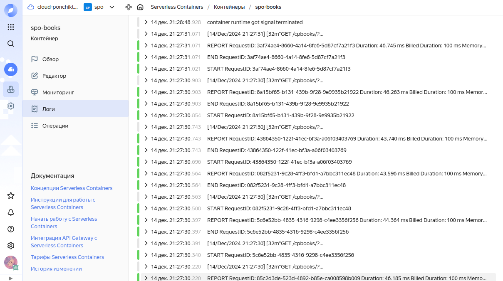

# Домашняя работа по дисциплине "Системное программное обеспечение"

## Задача:
1) Найти какой-либо проект на GitHub;
2) Запустить найденный проект с помощью Docker;
3) Запустить контейнер с проектом на какой-либо облачной платформе (например VK Cloud, Yandex Cloud), настроить мониторинг.

## Решение:

## 1) Поиск какой-либо проект на GitHub

 Для примера мной был взят проект, который реализует веб приложение магазина электронных книг
`https://github.com/diyajaiswal11/BookStore`

## 2) Запуск найденного проекта с помощью Docker

#### Сначала найденный проект нужно склонировать
```
git clone https://github.com/diyajaiswal11/BookStore
```
Файлы склонированного проекта переместила в отдельный новый проект

 В файле я изменила psycopg2==2.8.5 на psycopg2-binary==2.8.5

В файле bookstore/settings.py в строке 28 делаем ALLOWED_HOSTS = ["0.0.0.0", "127.0.0.1", "localhost", "*"]

#### В корне проекта создаем файл Dockerfile с данным содержимым
```
# Используем базовый образ Python
FROM python:3.7.4-slim

# Устанавливаем рабочую директорию
WORKDIR /app

# Копируем файл requirements.txt и устанавливаем зависимости
COPY requirements.txt requirements.txt
RUN pip install --upgrade pip
RUN pip install -r requirements.txt

# Копируем приложение в рабочую директорию
COPY . .

# Инициализация базы данных
RUN python manage.py makemigrations
RUN python manage.py migrate

# Запуск сервера
CMD ["python", "manage.py", "runserver", "0.0.0.0:8080"]

# Открываем порт
EXPOSE 8080
```

#### Cобираем проект с помощью команды
```
docker build -t books_webserver .
```

#### Запускаем контейнер с помощью команды
```
docker run -d -p 8080:8080 books_webserver
```

#### После запуска можно перейти по ссылке `http://localhost:8080` и проверить работоспособность проекта

Для входа нужно зарегистрироваться или авторизоваться


На сайте можно искать и скачивать книги


Также книги можно добавлять в понравившиеся


На сайте имеется функция добавления своих электронных книг


## 3) Запуск контейнера с проектом на облачной платформе, настройка мониторинга

Для развертывания контейнера и мониторинга мной был выбран Yandex Cloud.

Проходим регистрацию, регистрируем нашу организацию, получаем пробный период работы с платформой.

#### Сначала нам нужно создать реестр контейнеров



В нем будет содержаться созданный образ.

#### Далее создадим контейнер



Теперь, когда контейнер создан, можно проверить как он работает.

#### Перейти к контейнеру можно по ссылке: `https://bbajgebo692872d1909b.containers.yandexcloud.net`

Следующий шаг - сделать мониторинг ресурсов контейнера.

#### Общий мониторинг контейнера:



#### Также был создан такой дашборд:



#### Мониторинг триггера:



#### Логгирование контейнера:




## Автор

#### Работу выполнила Маркова Алёна Денисовна, студент группы Фт-320008.
